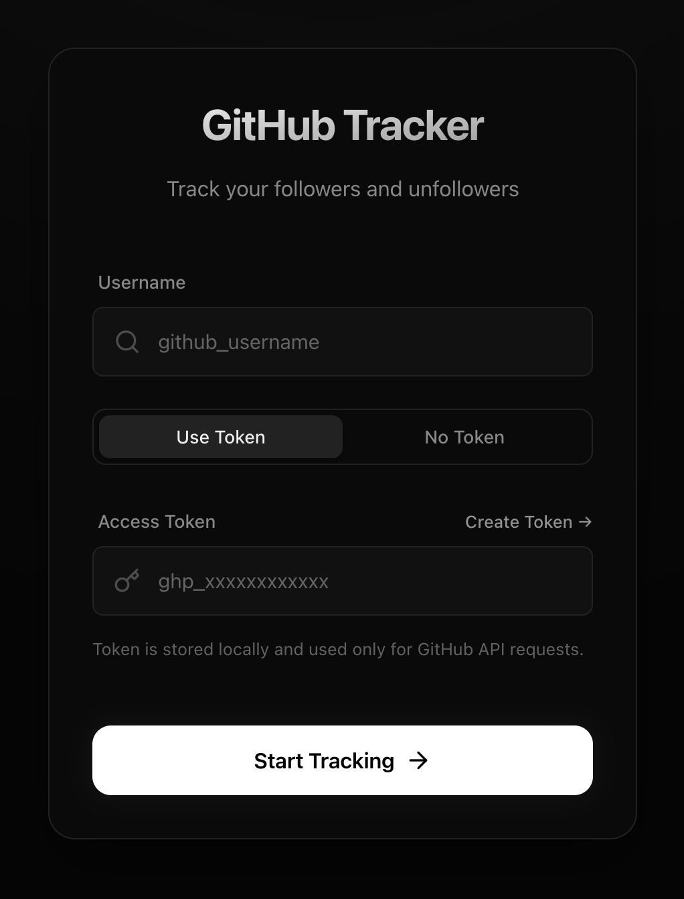
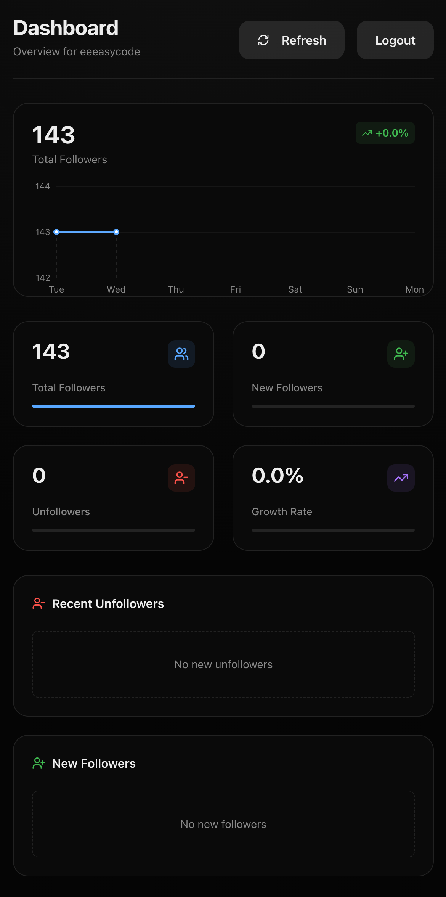

# GitHub Follower Finder

A simple web app to find unfollowers on GitHub.

  
  

## Features

- Find unfollowers on GitHub
- Save snapshots of followers
- Compare snapshots to find unfollowers

## Privacy

- No data is stored on the server
- All data is stored locally in the browser (use indexed DB)
